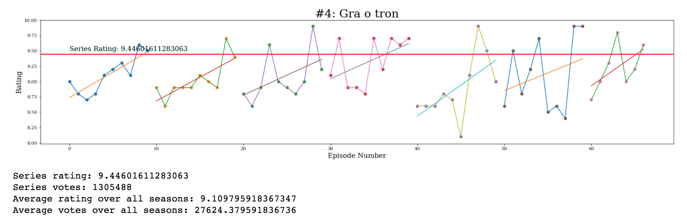
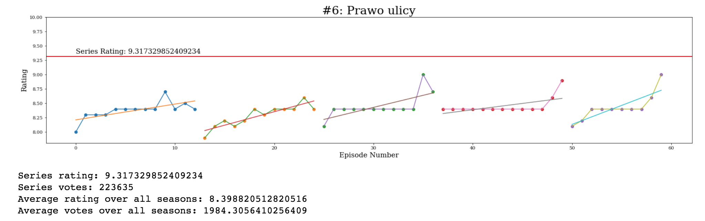
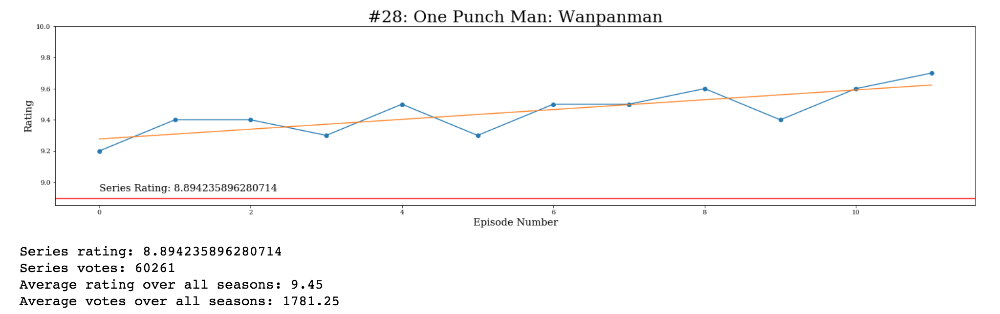

# IMDB series analysis
An analysis of the top rated series from IMDB. The notebook scrapes the top rated series episode by episode. It then graphs the the raiting of individual episodes (grouped by season) and compares them to the overall rating of the given show.

## Examples:

As we can see some series have the individual episodes rated very close to the rating of the over all series. Below is the results for **Game of Thrones:**

  

Other series have individual episodes rated qute a bit lower than than the overall rating. Such is the case for **The Wire:**

  

On rare occassions the rating of the individua episodes can exceed the rating of the overall series rating. We can see this is in the series **One Punch Man:**

  

